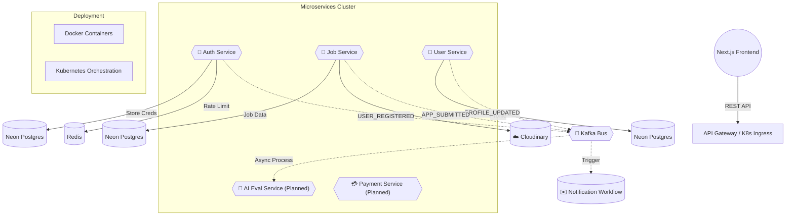

# � Scalable Microservices Job Platform

[](https://opensource.org/licenses/MIT)
[](https://nodejs.org/)
[](https://nextjs.org/)
[](https://kafka.apache.org/)
[](https://kubernetes.io/)

A distributed, high-performance job recruitment platform architected with a microservices approach to ensure modularity, scalability, and extreme reliability.

---

## 🏗️ System Architecture

The platform follows a distributed microservices architecture supporting user onboarding, job applications, payments, and AI-based resume evaluation. Communication is handled via REST APIs and an **asynchronous event-driven architecture using Kafka**.



---

## 🛠️ Tech Stack

### Frontend & Backend
- **Frontend**: [Next.js](https://nextjs.org/) (App Router, Tailwind CSS)
- **Runtime**: [Node.js](https://nodejs.org/) (ES Modules)
- **Framework**: [Express.js](https://expressjs.com/)
- **Language**: [TypeScript](https://www.typescriptlang.org/)

### Infrastructure & DevOps
- **Containerization**: [Docker](https://www.docker.com/) 
- **Orchestration**: [Kubernetes](https://kubernetes.io/) (K8s)
- **Message Broker**: [Apache Kafka](https://kafka.apache.org/) (Event-driven workflows)
- **Caching**: [Redis](https://redis.io/) (Caching & Atomic Rate Limiting)
- **Database**: [Neon.tech](https://neon.tech/) (Serverless PostgreSQL)
- **File Storage**: [Cloudinary](https://cloudinary.com/) 

---

## 📁 Service Breakdown & Key Achievements

### 🔐 Auth & Identity Management
- **Security**: JWT-based authentication with Bcrypt password hashing.
- **Optimization**: Integrated **Redis for rate limiting** to mitigate brute-force attacks and improve API responsiveness.

### 💼 Job & Application Engine
- **Workflow**: Implemented **Kafka-based workflows** for asynchronous job application processing.
- **Decoupling**: Used event-driven patterns to separate core job logic from notification and evaluation pipelines.

### 👤 User Profile & AI Synergy
- **Profiles**: Comprehensive management of candidate resumes and professional data.
- **AI Integration**: (In-Progress) Architected hooks for **AI-based resume evaluation** to rank candidates dynamically.

### ✉️ Notification & Email Workflows
- **Asynchrony**: Leverages Kafka consumers to trigger real-time email notifications without blocking the main application flow.

---

## ⚙️ Installation & Setup

### Prerequisites
- Node.js (v18+)
- Local or Cloud Kafka (e.g., Upstash)
- Local or Cloud Redis
- Neon Database instance

### Setup Instructions
1. **Clone & Install**:
   ```bash
   git clone https://github.com/Vivekveer31/microservices-job-platform.git
   cd microservices-job-platform
   npm install
   ```
2. **Environment Configuration**: Set up `.env` files in each service directory (`auth`, `job`, `user`) with your credentials.
3. **Run Services**:
   ```bash
   # Development mode with Auto-reload
   cd services/auth && npm run dev
   cd services/job && npm run dev
   cd services/user && npm run dev
   ```

---


## 👨‍💻 Author
**Vivek** - [GitHub](https://github.com/Vivekveer31)

---
